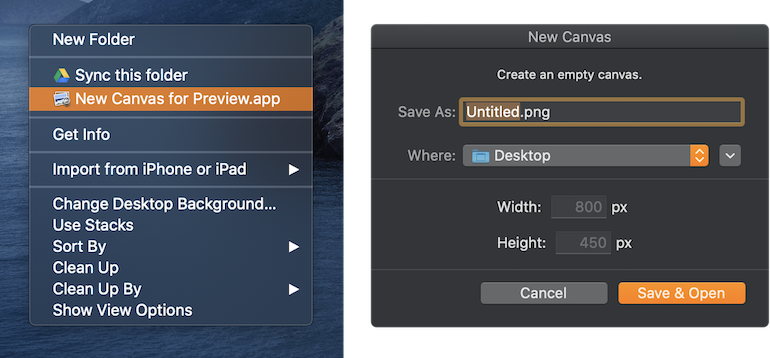
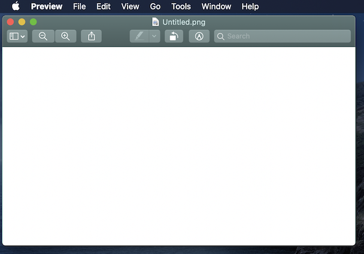
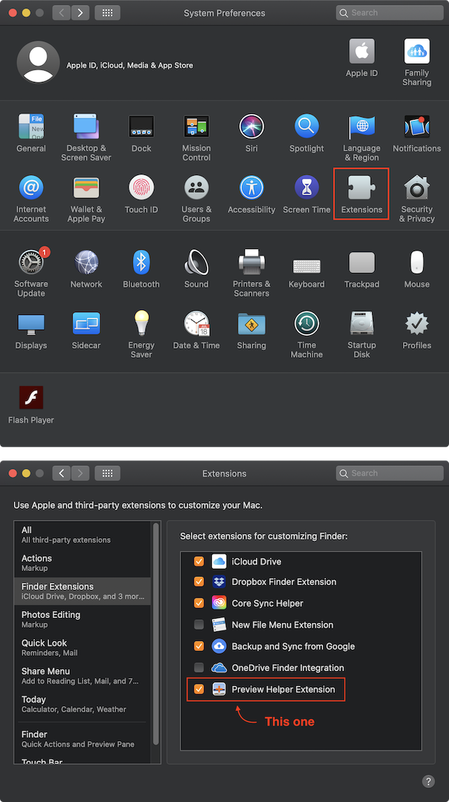

# Preview Helper

<!-- # Short Description -->

Create an empty canvas for Preview.app

<!-- # Badges -->

# Tags

`macOS` `Preview` `Swift`

# Demo

1. Open the menu by right-clicking on the Desktop or Finder.
1. Select "New Canvas for Preview.app".
1. Fill in the filename and the values of the canvas size.
1. A new empty canvas will be opened automatically with Preview.app.
  

**You can edit and draw objects on the canvas without any original resource!!**

# Advantages

- Simple
- Quick
- No hassle

# Installation

1. Download the dmg file from [Releases](https://github.com/Kyome22/PreviewHelper/releases).
1. Install PreviewHelper.app.
1. Open the app.
1. Open System Preferences -> Extensions.
1. Check the box of "Preview Helper Extension".

# Contributors

- [Kyome22](https://github.com/Kyome22)

<!-- CREATED_BY_LEADYOU_README_GENERATOR -->